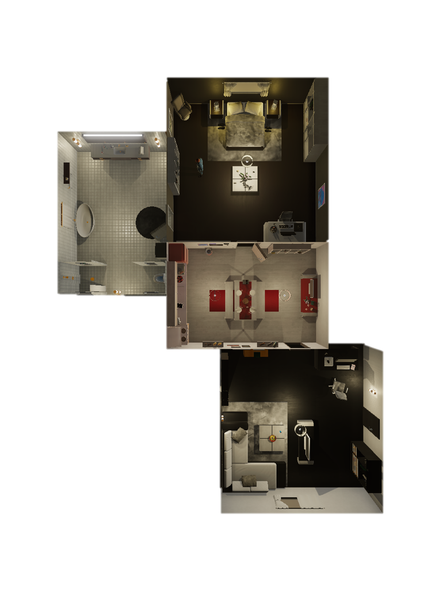
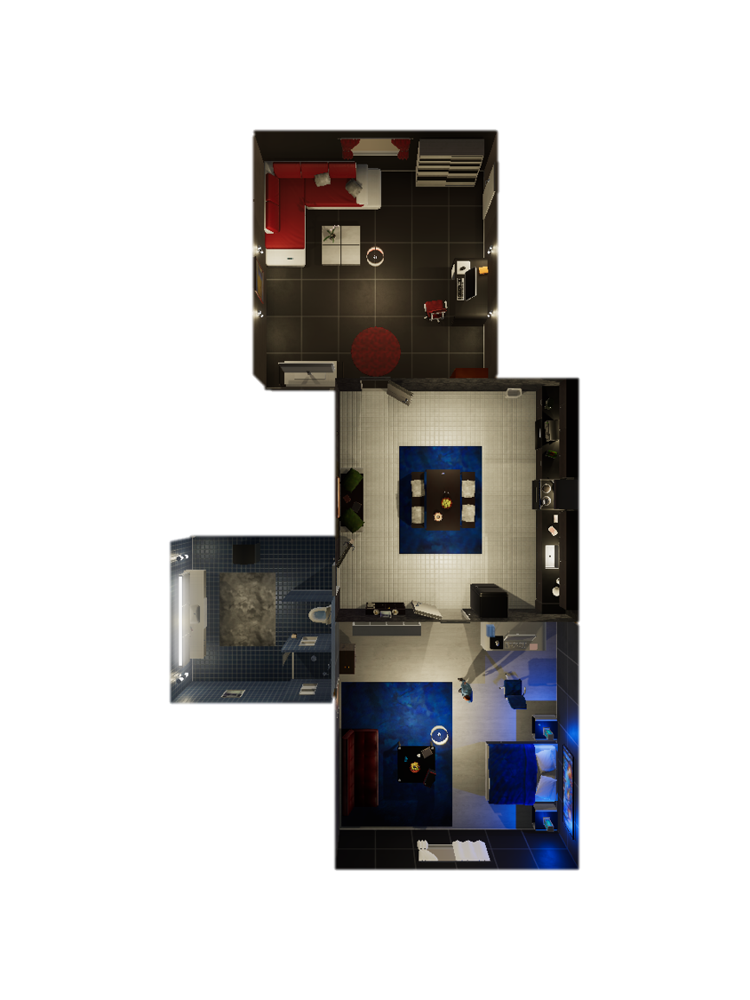
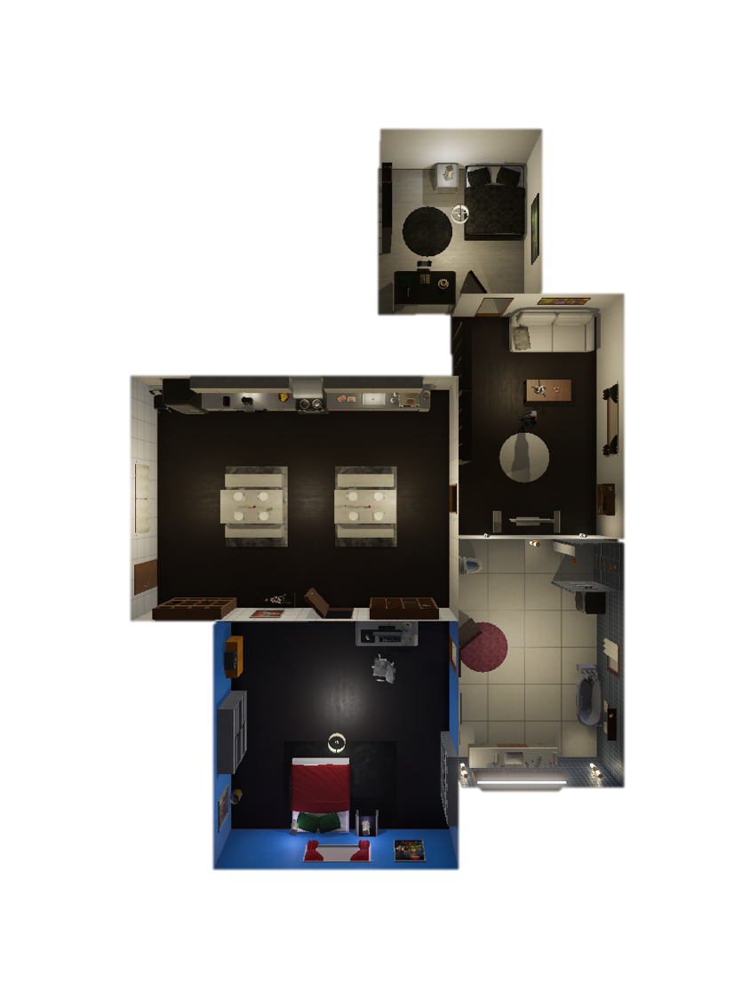
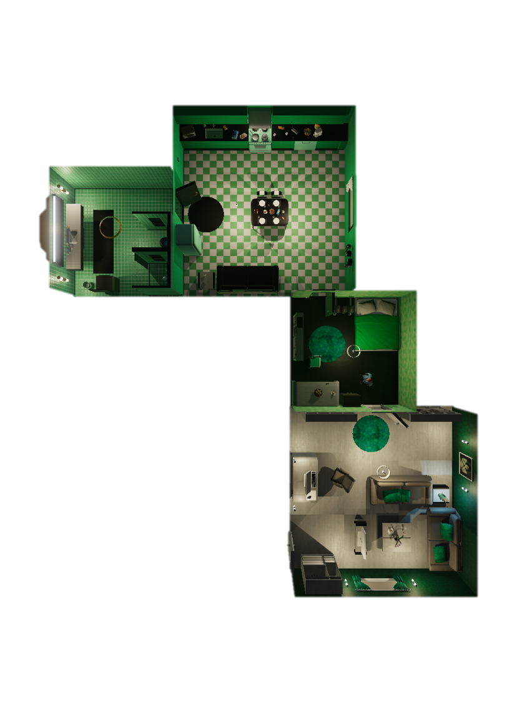
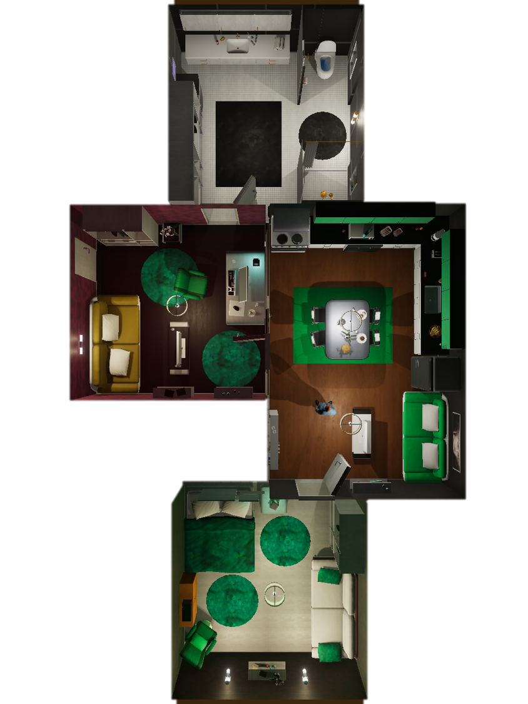
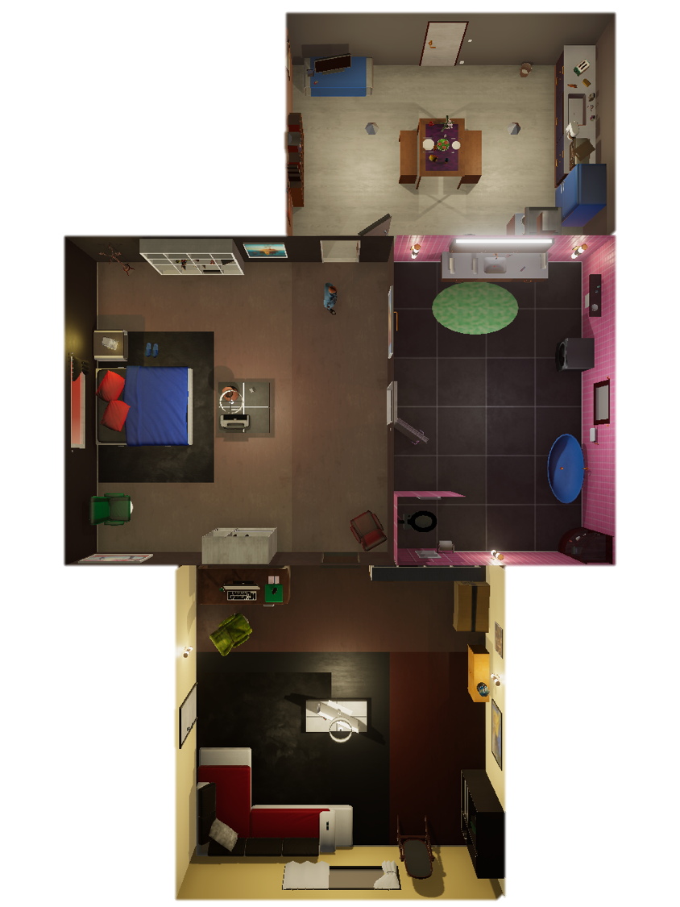
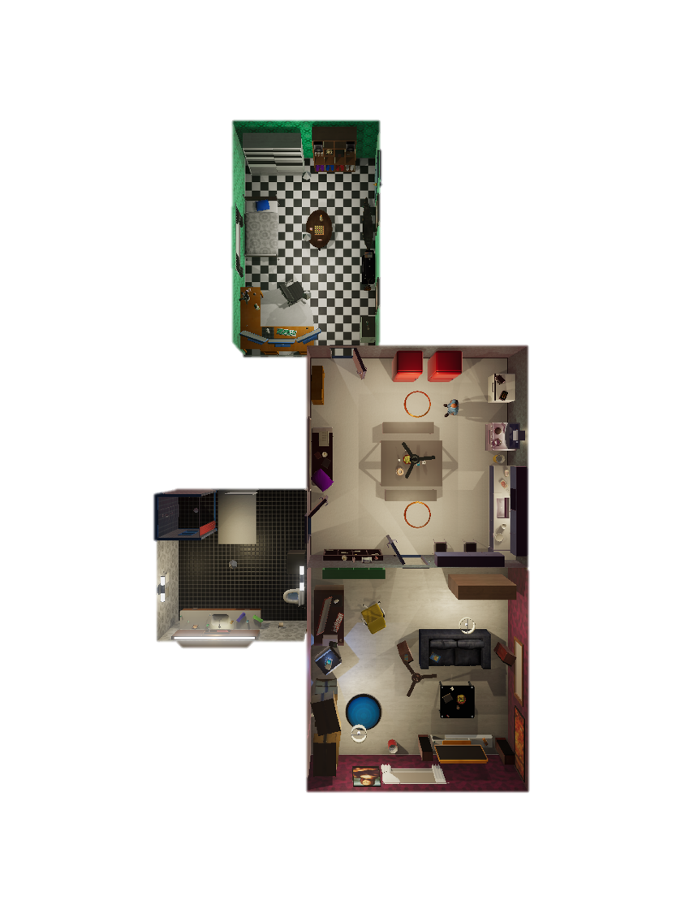

# Dataset
Move the dataset of programs and environments representing activities in this folder. The dataset should have the following structure:

```
programs_processed_precond_nograb_morepreconds
|── initstate
├── withoutconds
├── executable_programs
|   ├── TrimmedTestScene7_graph
|	└── ...
└── state_list
	├── TrimmedTestScene7_graph
   	└── ...	
```

Following, we describe the meaning of each folder, but first, let's introduce VirtualHome 2 main concepts, Environments and Programs.

## Environments
VirtualHome is composed of 7 scenes where activities can be executed. Each scene is encoded in a `.json` file containing a node for every object and edges between them representing relationships. Each environment can be updated by modifying the corresponding `.json` file. 

The files representing each apartment can be found in [example_graphs](../example_graphs/) as `TestScene{apt_id}_graph.json`. Each graph has a `Trimmed` version, which is used for the Evolving Graph simulator.

You can check in the [demo](../demo/unity_demo.ipynb) examples on how to read and update graphs.

| Scene 1   | Scene 2   | Scene 3   | Scene 4   | Scene 5   | Scene 6   | Scene 7  |
| ------------- | ------------- | ------------- | ------------- | ------------- | ------------- |------------- |
|  | | | | | | 

You can view the supported objects and states in [Resources]().

## Programs
Activities in VirtualHome are executed through programs. Each program is a sequence of instructions representing atomic actions that the agent will execute. Each program is stored in a `.txt` file with the following format. 

```
Program title
Program description


[ACTION_NAME] arg1 arg2
[ACTION_NAME] arg1 arg2
...
```
Each each argument has the format `<OBJECT_NAME> (ID_OBJECT)`. The number of arguments depends on the action type. The `(ID_OBJECT)` is used to tell the simulator that the actions should be done on the **same object instance**. For example a program as

```
[Walk] <glass> (1)
[Grab] <glass> (1)
```
Indicates that the agent should first walk to a glass, and then grab that same glass.

The programs can also have a precondition file, specifying the state of the objects before the program is executed.

You can view the supported actions, objects and preconditions in [Resources](../resources/).

## Dataset
The dataset is structured in 5 folders: initstate, withoutconds, executable_programs, init_and_final_graph and state_list. We describe this structure below.

### withoutconds
This folder contains the originally collected programs, following the format specified above. 

### initstate
We previously mentioned that programs can have preconditions, specifying certain constraints that an environment should satisfy in order to execute the program. For instance, if a program starts with `[Open] <fridge> (1)`, it is clear that `<fridge> (1)` should be initally closed. 

We did not collect such preconditions directly, but use a set of rules to extract them for every program, using [../dataset_utils/add_preconds.py](../dataset_utils/add_preconds.py). For each program in without conds, you can find a json with the same program path in `initstate`, containing the preconds.

### executable_programs
So far we have talked about programs and environments separately, but we want to execute each program in the environments. Let's say that we want to execute the previously mentioned program

```
[Walk] <glass> (1)
[Grab] <glass> (1)
```

In an environment that has 3 glasses with ids `23, 45, 58`. It is clear that the glass we walk to and grab should be the same, and that if there was a `<glass> (2)` we should be using a different glass, but how do we know if we should use `23, 45, 58`? This is what the `executable_programs` folder is for. 

For each program and its preconditions, we select one of the `TrimmedGraphs` representing an environment and use [graph_evolve simulator](../simulation/graph_evolve) to initialize the environment following the preconditions. Finally, we assign the objects in the program to objects in the graph. If the simulator decides that `<glass> (1)` should correspond to the glass with id `23`, a file will be created in `executable_programs/TrimmedTestScene{graph_id}_graph` looking as follows.

```
[Walk] <glass> (1.23)
[Grab] <glass> (1.23)
```

You can check [demo/generate_snapshot.py](demo/generate_snapshot.py) to see an example of how a program is created.

**Note**: When executing programs in the [unity_simulator](../simulation/unity_simulator), you will normally specify the id corresponding to an object existing in the environment, but you can also let the simulator decide which object (for instance which of the glasses to use) by setting the flag `find_solution=True`.

### init_and_final_graph, state_list
We have now modified the program to be executable in a given environment, and also modified the environment to match the programs preconditions. How does the environment look now? The graph is found in these 2 folders.

`init_and_final_graph` contains the first graph (before executing the program) and the last graph, when the program is executed using [graph_evolve simulator](../simulation/graph_evolve). If you want to execute the program in the [unity_simulator](../simulation/unity_simulator), make sure to set the environment according to id. That is:

```python
comm.reset(graph_id - 1)
with open('init_and_final_graph/{}'.format(graph_file), 'r') as f:
	graphs = json.load(f)
	first_graph = graphs['init_graph']
comm.expand_scene(first_graph)
``` 

### TLDR;
Knowing the structure of these folders is useful to understand and use the dataset, but you may get a faster glance by looking at [../demo/generate_snapshot.py](../demo/generate_snapshot.py). Additionally, you can find some utility functions using the dataset in [../dataset_utils/execute_script_utils.py](../dataset_utils/execute_script_utils.py).
